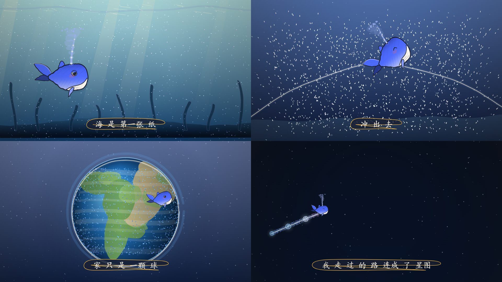
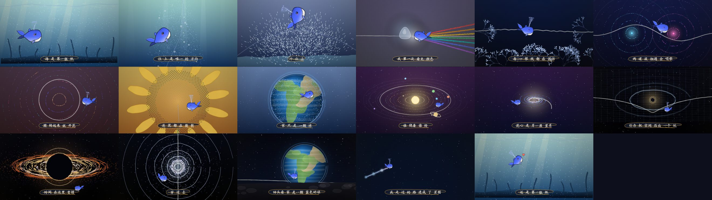
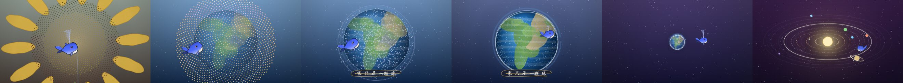

# 小鲸鱼 · 一直在游

> **45 秒全程序化动画短片。** 一只小鲸鱼从海里出发，穿过神经元、棱镜、双缝干涉、
> 向日葵、太阳系、螺旋星系、黑洞与时空，最后回到海里，继续游。
>
> **零运行时依赖**：纯 Canvas 2D + Web Audio，双击 `index.html` 就能看；
> 出片也不需要 `npm install`。

-blue)

---

## 它是什么

一部用代码画出来的短片：**1400 个粒子 + 一条 56 点的线 + 一只小鲸鱼**，
在 45 秒里重组成 13 种形态。全片**没有一处硬切**——每个场景都是**上一个场景形变过去的**。

| 时间 | 幕 | 字幕 |
|---|---|---|
| 0.0–4.6 | 海洋 | 海 是 第一张 纸 |
| 4.6–8.4 | 神经元 | 世界 是一张 网 |
| 8.4–11.8 | 三棱镜色散 | 光 有 七种 颜色 |
| 11.8–15.0 | 双缝干涉 | 两 道 波 相遇 会 唱歌 |
| 15.0–17.8 | 色彩光环 | 圆 转起来 就 开花 |
| 17.8–21.2 | 向日葵（黄金角叶序） | — |
| 21.2–24.4 | 太阳系（7 颗行星 + 土星环） | 谁 绕着 谁 转 |
| 24.4–28.0 | 螺旋星系 | 花心 是 另一座 星系 |
| 28.0–31.2 | 时空网格 + 引力波 | 引力 把 空间 压出 一个 坑 |
| 31.2–35.0 | 黑洞吸积盘 | 时间 在这里 变慢 |
| 35.0–38.4 | 宇宙隧道 | 穿 过 去 |
| 38.4–42.2 | 地出 | 隧道 尽头 有光 · 回头看 家 是一颗 蓝色的球 |
| 42.2–45.0 | 回到海洋 | 所以 继续 游 |

---

## 核心设计：没有「幕」，只有「形变」

常规做法是"一场一场画 + 硬切"。这里不是。全片只有 **3 个从头到尾都存在的"演员"**：

| 演员 | 它变成过什么 |
|---|---|
| **粒子场（1400）** | 海洋浮游 → 神经节点 → 光谱 → 干涉波前 → 同心环 → 葵花籽 → 行星轨道 → 星系旋臂 → 时空网格 → 吸积盘 → 隧道环 → 地球云 → 海洋 |
| **线（56 点）** | 海面 → 树突 → 光束 → 正弦波 → 圆弧 → 花茎 → 椭圆轨道 → 旋臂 → 被弯折的光线 → 吸积盘缘 → 垂直光柱 → 月面地平线 → 海面 |
| **小鲸鱼** | 全片都在，只是越游越小、越游越远，最后又游回来 |

每个粒子的位置是**两种形态的加权混合**：

`@js
pos(i, t) = form[形态A](i, t) × (1 − k) + form[形态B](i, t) × k
`@

所以粒子是**真的从花盘飞到星系轨道上**，不是叠化。位置、拖尾、粗细、颜色、透明度一起插值。

下面是"向日葵 → 太阳系 → 星系"这段的连续 6 帧（每帧间隔 0.7s，**没有剪接**）：

### 三条铁律

1. **每一帧都是时间 `t` 的纯函数**——没有跨帧状态、没有 `Math.random()`。
   换来两件事：帧能**并行乱序**渲染（5 个无头 Chrome 抢帧）；同 `t` 永远出同一张图（可复现、可补帧）。
2. **随机分两种**：`hash(i)` 是"物体本身长这样"（稳定）；`jit(a)` 是"手在抖"
   （每 1/12 秒重播种 → 线稿**沸腾**，就是手绘动画的 boil）。
3. **透明度要乘不要覆盖**——所有绘制 helper 内部都是 `alpha = alpha × (op/255)`。

---

## 快速开始

`@bash
git clone <this-repo> && cd whale-odyssey
# 不需要 install。直接：
双击 index.html
`@

| 快捷键 | 作用 |
|---|---|
| 空格 | 播放 / 暂停 |
| ← → | 前后 1 秒 |
| Shift + ← → | 前后 5 秒 |
| R | 回到开头 |
| P | 导出当前帧 PNG |
| F | 全屏 |

调试参数：`?t=22` 静帧 · `?render=1` 离线渲染模式 · `?bare=1` 只留画布 · `?rig=1` 角色姿势检查

> `index.html` 用的是**经典 `<script>` 而不是 ES module**，所以 `file://` 双击可用
> （module 会被 CORS 拦）。同理 `fetch` 本地文件会失败，所有数据都写在 js 里。

---

## 技术栈

| 层 | 选择 |
|---|---|
| 运行时 | **原生 JS + Canvas 2D**，经典 `<script>`，无框架无构建 |
| 循环 | `requestAnimationFrame` |
| 音频 | **Web Audio API**（`OfflineAudioContext` 离线合成 / `MediaRecorder` 录 WebM） |
| 图形 | 全程序化：粒子、贝塞尔、渐变、自写铅笔排线 `hatchFill()`。**零图片 / 零贴图 / 零网络字体** |
| 出片 | **Node + 原生 Chrome DevTools Protocol + ffmpeg**（零 npm 依赖） |

**刻意没用**：Vite、TypeScript、React、Three.js、p5.js、p5.brush、puppeteer。
理由写在 [REFERENCES.md](REFERENCES.md) §4/§7 —— 简单说：动画短片不需要 UI 工具链，
零依赖才能"双击即开 + 离线渲染零安装"，而手绘插画质感用 Canvas2D 就够。

---

## 配乐

成片用的是 **The Chainsmokers & Coldplay《Something Just Like This》**。BPM 不是猜的，是实测的：

`@bash
node analyze-bgm.mjs assets/bgm.mp3 --target=45
`@

| 项 | 实测值 |
|---|---|
| BPM | **103.00**（BPM × 相位联合精修） |
| 第一拍 / 小节重拍 | 0.412 s |
| 每小节（4/4） | 2.330 s |

**选段原则：让片子最贵的那一幕落在副歌上。** 本片高潮是"黑洞"（片内 30.5s），
所以从原曲小节线 **20.5318s** 切 45 秒 → 黑洞落在副歌、片尾落在副歌高潮；
切点在小节线上 ⇒ 片内 `t=0` 就是重拍 ⇒ 整片节拍网格与歌曲重合（复核误差约 **7 ms**）。

> ⚠️ **版权**：这首歌是商业发行作品。仓库里**不包含**它（见 `.gitignore`），
> 请自行准备音乐文件。发布的成片请换成自有或已授权音乐——换歌流程见 [HANDBOOK.md](HANDBOOK.md) §6.1。

---

## 导出成片

`@bash
node render.mjs --selftest                          # 自检：幕数 / 音轨 / JS 错误
node render.mjs --sheet=0,6,12,20,26 --cols=4 --w=430 --out=out/sheet.jpg   # 联络表（审片用）

# 整片（推荐）
node render.mjs --dumpdemo=out/demo.wav             # 没音乐时先导出内置合成音轨
node render.mjs --frames=0:45 --fps=30 --workers=5 --out=out/frames   # 逐帧，可断点续传
node render.mjs --encode --fps=30 --audio=assets/bgm-45s.m4a --out=out/whale-odyssey.mp4

# 只渲一小段
node render.mjs --clip=25:32 --fps=30 --audio=assets/bgm-45s.m4a --out=out/clip.mp4
`@

需要本机有 **Chrome** 与 **ffmpeg**。渲染器不用 puppeteer，它用 Node 内置的 `fetch` /
`WebSocket` 直连 Chrome DevTools Protocol（`--remote-debugging-port=0` + 读 `DevToolsActivePort`）。

实测：1350 帧 @ 5 workers ≈ 3–4 分钟，ffmpeg 编码 ≈ 2.5 分钟。

---

## 目录结构

`@text
index.html          播放器页面（经典 <script> 按顺序加载）
js/core.js          引擎内核：数学 / 确定性抖动 / 铅笔排线 / 纸纹 / 相机 / 手写字 / 群飞·叶序·分叉·棱镜·黑洞
js/char.js          主角小鲸鱼（支持 paint/sketch：铅笔稿 → 上色两个阶段）
js/props.js         道具：气泡 / 音符 / 波纹 / 海草 / 数据光点
js/odyssey.js       ★ 剧本：13 幕形态系统（换片子只改这个）
js/audio.js         音频：示范 BGM 离线合成 / 外部 BGM / 节拍器 / 导出 WAV
js/main.js          播放器逻辑 + 离线渲染接口（window.renderAt / renderSheet）
render.mjs          离线渲染器
analyze-bgm.mjs     配乐分析器（实测 BPM / 拍点 / 段落结构 / 推荐选段）
docs/               README 用图
assets/             放你自己的 bgm（已被 .gitignore 排除）
out/                渲染产物（已被 .gitignore 排除）
`@

**分层原则：把"画什么形状"和"怎么画"分开。** `odyssey.js` 只管形状与时间，
`core.js` 只管笔触与质感。所以想换材质（比如换成 p5.brush 水彩）只动 `core.js` 一层，
13 幕剧本一行不改。

---

## 文档

| 文件 | 内容 |
|---|---|
| [HANDBOOK.md](HANDBOOK.md) | **复用手册**：技术栈 / 引擎 API 速查 / 形态系统 / 时间轴与音频 / 出片 / **14 条踩坑记录** / 性能 / 新片检查清单 |
| [REFERENCES.md](REFERENCES.md) | **参考资料**：所有仓库与链接地址、视觉参考片分析、数学与物理公式出处、逐项标注实测/引用/存疑 |

---

## 已知取舍

- **实时播放吃性能**：1400 粒子 + 多条曲线，低端机 30fps 可能掉帧；**离线渲染不受影响**。
- **手绘质感优先于物理正确**：微波背景那一幕是多正弦叠加的**视觉近似**（真做要球谐函数）；
  引力波用指数衰减代替 `1/r`。逐条标注见 [REFERENCES.md](REFERENCES.md) §8。
- **材质是「平涂 + 抖动线条 + 铅笔排线」**，不是 p5.brush 那种水彩。想换水彩见 [HANDBOOK.md](HANDBOOK.md) §11-C。
- **音画同步以 AudioContext 时钟为准**；输出延迟大时用页面上的「偏移」微调。
- **参考片的原始出处未确认**（B 站为搬运版），详见 [REFERENCES.md](REFERENCES.md) §11。

---

## 许可

- **代码**：MIT，见 [LICENSE](LICENSE)。
- **成片中的配乐**：不属于本项目，版权归原权利人，**未获授权**，请勿公开分发带该音乐的成片。
- **参考与灵感**来源见 [REFERENCES.md](REFERENCES.md)，其中 p5.brush（MIT）与 PDoomVideo（ISC）的
  代码**均未被复制进本仓库**——本项目只在架构思路层面受其启发。
